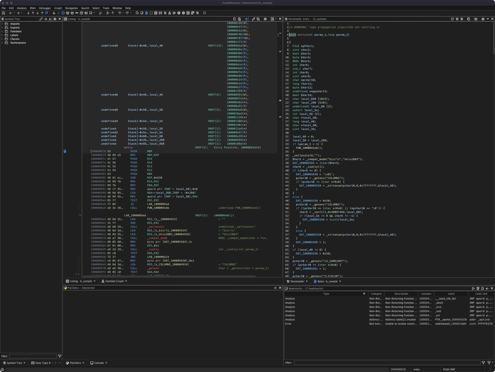

# VS Code Dark Modern Theme for Ghidra

[English](README.md) | 日本語

Ghidra 12.0.4 PUBLIC 向けの VS Code Dark Modern 風テーマです。



このパッケージは Ghidra のテーマファイルと外部アイコン素材で構成されています。インストール先は Ghidra のユーザー設定ディレクトリで、Ghidra 本体のディレクトリ、jar ファイル、署名済みバイナリは変更しません。

## 内容

- `themes/vscode-dark-modern.theme`
- `images/vscode/codicons/`
- `install.ps1`
- `install.sh`

`images/vscode/codicons/` には、テーマが `[EXTERNAL]images/vscode/codicons/...` として参照する PNG アイコンと Codicons のライセンスファイルが含まれています。

## Windows でのインストール

Windows / Ghidra 12.0.4 PUBLIC では、このリポジトリのディレクトリで PowerShell を開いて実行します。

```powershell
Set-ExecutionPolicy -Scope Process -ExecutionPolicy Bypass
.\install.ps1
```

インストーラーはテーマを次の場所にコピーします。

```text
%APPDATA%\ghidra\ghidra_12.0.4_PUBLIC
```

手動でインストールする場合:

```powershell
$GhidraUserDir = Join-Path $env:APPDATA 'ghidra\ghidra_12.0.4_PUBLIC'

New-Item -ItemType Directory -Force -Path "$GhidraUserDir\themes" | Out-Null
New-Item -ItemType Directory -Force -Path "$GhidraUserDir\images\vscode\codicons" | Out-Null

Copy-Item .\themes\vscode-dark-modern.theme -Destination "$GhidraUserDir\themes\" -Force
Copy-Item .\images\vscode\codicons\* -Destination "$GhidraUserDir\images\vscode\codicons\" -Recurse -Force
```

別の Ghidra バージョンで使う場合は、`ghidra_12.0.4_PUBLIC` を自分の Ghidra ユーザー設定ディレクトリ名に置き換えてください。

インストール先を明示する場合:

```powershell
.\install.ps1 -GhidraUserDir '<Ghidra user settings directory>'
```

## macOS / Linux でのインストール

```sh
git clone https://github.com/pinksawtooth/VS_Code_dark_modern_theme.git
cd VS_Code_dark_modern_theme
./install.sh
```

インストール先を明示する場合:

```sh
GHIDRA_USER_DIR="<Ghidra user settings directory>" ./install.sh
```

## テーマの有効化

1. Ghidra を起動、または再起動します。
2. `Edit` -> `Theme` を開きます。
3. `VS Code Dark Modern` を選択します。
4. 一部 UI に反映されない場合は Ghidra を再起動してください。

## 更新

最新版を取得して、もう一度インストーラーを実行します。

```powershell
git pull
.\install.ps1
```

## Windows でのアンインストール

```powershell
$GhidraUserDir = Join-Path $env:APPDATA 'ghidra\ghidra_12.0.4_PUBLIC'

Remove-Item "$GhidraUserDir\themes\vscode-dark-modern.theme" -Force
Remove-Item "$GhidraUserDir\images\vscode\codicons" -Recurse -Force
```

その後、Ghidra を再起動して別のテーマを選択してください。

## 備考

- Ghidra のユーザーインストールテーマはユーザー設定ディレクトリに保存されます。Windows の既定設定ディレクトリは `%APPDATA%\ghidra\ghidra_<version>` です。
- Ghidra 本体が別のアプリケーションディレクトリにある場合でも、このテーマは Ghidra が検出できるユーザー設定ディレクトリにコピーしてください。
- このテーマは Ghidra のテーマ機能で扱える範囲に限定しています。
- Ghidra 本体ファイル、jar、署名済みファイルは変更しません。
- Ghidra 12.0.4 PUBLIC で検証しています。
